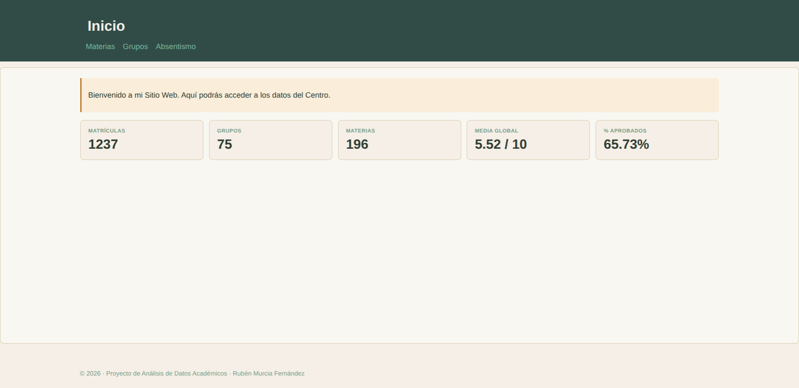
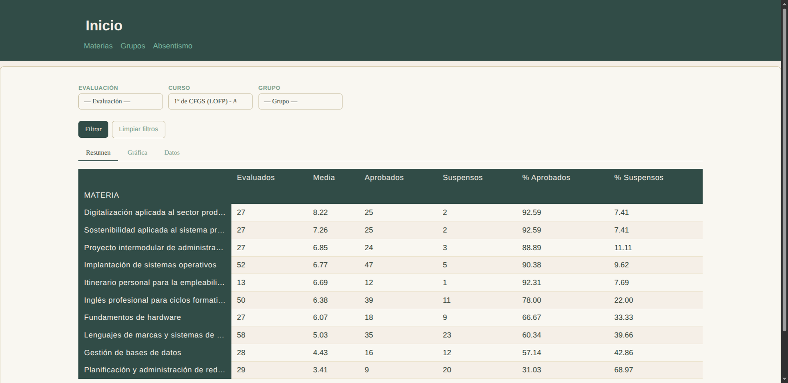
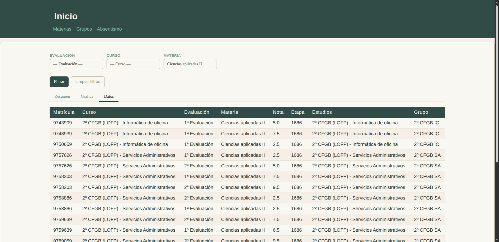
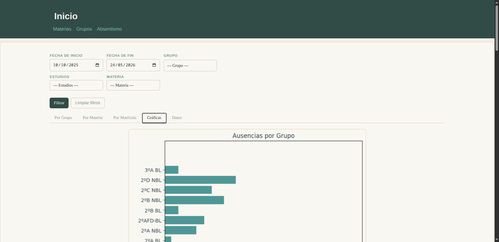

# Proyecto de Análisis de Datos y Aplicación Web
> Hecho por **Rubén Murcia** ([GitHub](https://github.com/rubmurfer/analisis-de-datos))

## Contenido
- Introducción
- Requisitos
- Instalación
- Arranque
- Estructura de carpetas y ficheros
- Imágenes de las Páginas

---
# Introducción
En este proyecto, se nos ha encargado la tarea de analizar datos anónimos de nuestro centro educativo para su limpieza y presentación en un Sitio web interactivo.

El sitio web cuenta con cuatro páginas:
- **Inicio**: Página de bienvenida con datos globales resumidos.
- **Materias**: Página dedicada al análisis del rendimiento académico por **materias**.
- **Grupos**: Página dedicada al análisis del rendimiento académico por **grupos**.
- **Absentismo**: Página dedicada al análisis del **absentismo**.

Las páginas principales cuentan con varios subapartados diseñados para su navegación intuitiva:
- **Formularios**: En cada página podrás filtrar los datos por diferentes campos de manera simultánea.
- **Resúmenes**: En este apartado se podrán ver los datos estadísticos más relevantes.
- **Gráficas**: Las gráficas permiten ver de manera más visual algunos de los datos obtenidos en **Resúmenes**.
- **Datos crudos**: En este apartado, se podrán ver directamente los datos limpiados del **DataFrame**.

---
# Requisitos
Los requisitos de esta aplicación están listados en el fichero llamado `requirements.txt`. Para instalar las dependencias necesarias, se recomienda encarecidamente usar el comando `pip install -r requirements.txt` dentro de un **entorno virtual (.venv)**.

Las librerías principales son las siguientes:
- `NumPy`
- `Pandas`
- `MatplotLib`
- `Flask`

---
# Instalación
Los pasos de instalación y arranque son los siguientes:

1. Descargar de este repositorio (preferiblemente desde [GitHub](https://github.com/rubmurfer/analisis-de-datos)).
2. Para crear un **entorno virtual** usamos: `python -m venv .venv` en la carpeta del proyecto -> `source .venv/bin/activate`(Linux / MAC) o `.venv\Scripts\activate`(Windows).
3. Instalar las dependencias en un entorno controlado con `pip install -r requirements.txt`.
4. Arrancar la aplicación con `python app.py` desde la carpeta del proyecto.
5. Acceder al sitio web local desde la **URL**: `http://127.0.0.1:5000/` o `localhost:5000`.

---
# Estructura de carpetas y ficheros

```
analisis-de-datos/
│
├── app.py                  # Rutas y lógica principal de Flask
├── requirements.txt        # Dependencias del proyecto
├── README.md               # Este fichero
├── datos.zip               # CSVs anonimizados del centro
│
├── utils/
│   ├── carga_datos.py      # Carga y limpieza de los CSVs
│   ├── calcular_datos.py   # Merges, filtros y métricas
│   └── crear_graficas.py   # Funciones de gráficas matplotlib
│
├── templates/
│   ├── base.html           # Plantilla base con navegación
│   ├── inicio.html         # Dashboard principal
│   ├── materias.html       # Rendimiento por materia
│   ├── grupos.html         # Rendimiento por grupo
│   └── absentismo.html     # Análisis de absentismo
│
└── static/
    └── style.css           # Estilos de la aplicación
```

---
# Imágenes de las páginas

> ### Inicio


> ### Materias/Resumen


> ### Grupos/Datos


> ### Absentismo/Gráficas
